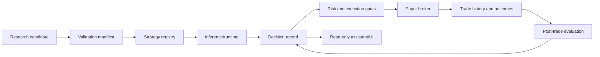

# Phase 1 Architecture and Research Audit

Audit date: 2026-09-23  
Scope: current root runtime, Model 1A/1B/2 training and inference, Phase 2 strategy research, paper execution, persistence, and proposed trade-assistant workflow.

## Final Classification

**SIGNAL-GENERATING PAPER RUNTIME; NOT YET A VERSIONED, EXPLAINABLE STRATEGY PLATFORM**

The repository can prepare market data, run the three current model families,
write current signals, apply deterministic risk sizing, and manage paper trades.
It cannot yet identify a strategy as a versioned production object, reproduce an
individual decision from persisted inputs, or safely promote research candidates
through an untouched holdout process.

Existing audit artifacts are preserved. This report consolidates the broader
architecture findings and makes no runtime or research-code changes.

## Executive Findings

| ID | Severity | Finding | Consequence |
|---|---|---|---|
| F1 | Critical | No strategy registry or versioned strategy definition exists. | Signals and trades cannot be tied to an immutable strategy/configuration identity. |
| F2 | Critical | No immutable decision-record table or event contract exists. | A later operator cannot reconstruct inputs, gates, risk calculation, and final action for one decision. |
| F3 | Critical | Phase 2 robust classification consumes OOS metrics for selection and profile derivation. | `ROBUST STRATEGY FOUND` is not promotion evidence; it is a research-screen result. |
| F4 | High | Root Model 1 trainer imports purged walk-forward support but executes one `fixed_test` split. | Current artifacts do not verify the documented multi-fold validation claim. |
| F5 | High | The Model 1 timeframe contract is inconsistent across executable code and documentation. | The checked-in crypto/equity configs and current trainer enforce `5m`, while the trainer documentation and broader architecture notes describe a 1h architecture. |
| F6 | High | UI is read-only and has no strategy, decision, or trade-assistant workflow. | Operators can inspect state but cannot review, compare, acknowledge, or annotate a controlled candidate decision. |
| F7 | Medium | Runtime and legacy/generic ML paths coexist without a first-class provenance namespace. | Artifact interpretation depends on directory conventions and manual knowledge. |

## Current Runtime

The active root runtime is a four-process design:

```text
market providers -> live_daemon.py -> market_state/signals
                                      |
                                      v
                              paper_broker.py -> open_trades/trade_history
                                      |
                                      v
                                  app.py (read-only)
```

- `live_daemon.py` loads Model 1A crypto, Model 1B equity intraday, and Model 2
  equity swing models. It writes current market state and one current signal per
  `(asset, model_type)`.
- `paper_broker.py` applies score thresholds, market/feed gates, equity model
  agreement, shared-wallet risk limits, stops, take-profits, funding, and
  regime-flip exits.
- `risk_engine.py` is deterministic and stateless. It converts a `TradeSetup`
  into stop, target, leverage, margin, quantity, and rejection values.
- `state_db.py` persists operational state, open positions, closed trades, and
  an equity curve. It is not yet a research or decision ledger.
- `app.py` reads the database for radar, portfolio, history, and strategy
  telemetry. It does not define or mutate strategy state.

This separation is a sound operational boundary. The missing boundary is
identity and provenance: the runtime stores what is current, but not which
versioned strategy definition produced it or why a particular action was taken.

## Model and Asset Architecture

The existing [ML multi-asset dataflow audit](ml_multi_asset_dataflow_audit.md)
remains authoritative for asset isolation:

| Family | Targets | Context | Current status |
|---|---|---|---|
| Model 1A crypto | BTC/USDT, ETH/USDT | Target-local features in the dedicated config | Separate target models; no current BTC-to-ETH feature path found |
| Model 1B equity intraday | QQQ/SPY proxy assets | VIX, US10Y, EURUSD, Gold, WTI, DAX | Separate target models with causal context |
| Model 2 equity swing | QQQ, SPY | Daily macro context plus target-local 1h/5m entry branches | Separate checkpoints with matching-asset fusion |
| Shared paper wallet | BTC, ETH, QQQ, SPY | Downstream risk and concurrency only | Portfolio coupling, not training leakage |

The target-specific versus contextual design is legitimate. It must now be made
explicit in the strategy metadata rather than inferred from model directories and
configuration files.

## Validation and Promotion Readiness

### Model 1

`core/ml/train.py` imports `purged_walk_forward_splits`, but the inspected
`train_symbol_model` path calls `chronological_purged_split`, fits one model, and
records one metric with `"fold": "fixed_test"`. The final model is appropriate
for prospective inference, but the current artifact metadata does not prove a
five-fold purged walk-forward evaluation.

The immediate acceptance test is simple: a fresh training artifact must contain
the configured number of fold records, each with explicit train/test boundaries,
purge/embargo values, sample counts, and metrics. Until then, validation status
must be `PARTIAL`, not `PURGED_WALK_FORWARD_VERIFIED`.

### Model 2

Model 2 has a richer multi-horizon target structure and causal macro alignment.
The audit should require persisted split timestamps, purge boundaries, feature
manifest, and training cutoff for each checkpoint before the model is treated as
reproducible research evidence.

### Phase 2 strategy research

The Phase 2 report says `ROBUST STRATEGY FOUND`, but the implementation defines
robustness in `_robust_gate` using validation, walk-forward, stress, and also
OOS return/Sharpe. `_derive_profiles` then chooses Conservative/Balanced/
Aggressive profiles from those rows using OOS drawdown, Sharpe, and return.

That is a valid screening report, but it is not a clean promotion protocol when
the same OOS evidence is used to classify and select candidates. The report also
states that funding is not tested and that equity assets have insufficient local
data. Therefore:

- `ROBUST STRATEGY FOUND` must be relabeled operationally as
  `RESEARCH_SCREEN_PASS`.
- No Phase 2 candidate or derived profile is paper/live eligible from this report
  alone.
- A future promotion run needs a frozen candidate set, a declared selection
  window, an untouched chronological holdout collected after selection, funding
  treatment, and a signed/manual promotion decision.

The [partial-exit holdout](../partial_exit/partial_exit_holdout.md) demonstrates
the desired discipline more clearly: it explicitly records that the data is not
pristine and blocks promotion despite some promising risk-management results.

## Missing Platform Abstractions

### Strategy registry

The minimum registry record should be immutable once referenced by a decision:

| Field | Purpose |
|---|---|
| `strategy_id`, `strategy_version` | Stable identity and reproducibility |
| `family`, `candidate_id` | Research lineage, such as `breakout_atr_40_1.0` |
| `asset_scope`, `asset_class`, `instrument_type` | Prevent applying an equity-underlying policy to a crypto perpetual |
| `horizon_class`, `timeframe`, `label_horizon` | Make execution horizon explicit |
| `feature_set_id`, `feature_manifest_hash` | Identify inputs and detect train/serve drift |
| `model_artifact`, `model_version`, `training_cutoff` | Identify the exact model evidence |
| `risk_policy_id`, `execution_policy_id` | Bind stops, sizing, fees, and order behavior |
| `validation_status`, `promotion_state` | Separate research, shadow, paper, and approved states |
| `created_at`, `approved_at`, `approved_by` | Audit ownership and manual approval |

The registry should be append-only in practice. A changed parameter creates a new
version; it does not mutate the version already used by a trade.

### Decision records

Persist one record for every signal evaluation and action, including rejected or
no-trade outcomes. The record should contain:

1. event timestamp, asset, market/session state, and data-health snapshot;
2. strategy ID/version and model artifact IDs;
3. feature-set ID or a compact feature/input snapshot, with source timestamps;
4. raw model outputs, derived scores, direction, expected return, MFE, MAE, and duration;
5. all gates and their individual pass/fail reasons;
6. risk-engine inputs and complete output, including rejection reason;
7. portfolio state used for sizing, including open risk and available capital;
8. final action: `NO_TRADE`, `ALERT`, `PAPER_ENTRY`, `PAPER_EXIT`, or `HOLD`;
9. linked trade ID and decision-record hash/version for tamper evidence.

This is separate from `signals`, which is a latest-state table, and from
`trade_history`, which records execution outcomes rather than the full decision
context.

### Trade assistant and UI

The assistant should be a read-only decision surface first, not an order-entry
shortcut. Its first useful workflow is:

```text
candidate signal -> explain gates -> show risk scenarios -> operator acknowledgement
                  -> persist decision/annotation -> paper action remains separately gated
```

Required views are strategy/version provenance, current candidates, rejected
reasons, risk profile comparison, decision history, and promotion status. Any
future action control must require an explicit paper/live mode and preserve the
same decision record used for the action.

## Target Architecture



The registry is the join point between research and runtime. Decision records
are the join point between inference, risk, execution, UI, and later evaluation.
Neither should be reconstructed retrospectively from current-state tables.

## Recommended Implementation Sequence

1. **Freeze contracts:** define strategy lifecycle states and immutable IDs;
   classify existing artifacts as `LEGACY`, `RESEARCH`, `SHADOW`, or `PAPER`.
2. **Add registry persistence:** create a versioned strategy table and seed only
   existing, explicitly identified runtime strategies. Do not promote Phase 2.
3. **Add decision records:** persist all gate outcomes and link paper trades to
   the originating decision record.
4. **Repair validation metadata:** either wire true purged walk-forward folds into
   the root trainer or rename the current result as fixed chronological testing.
5. **Repair timeframe provenance:** make the checked-in configuration, trainer,
   cached data, model metadata, and daemon contract agree before retraining.
6. **Add the assistant UI:** expose explanations, risk profiles, provenance,
   annotations, and promotion state from the registry and decision ledger.
7. **Re-run research gates:** separate candidate selection from untouched holdout
   evaluation, include funding where applicable, and require manual approval.

Each stage should have focused tests and a migration path for the existing SQLite
database. No stage should silently reinterpret old trades as belonging to a new
strategy version.

## Explicit Non-Goals

- Do not pool BTC and ETH training samples merely to make the registry generic.
- Do not add new indicators or retune strategy parameters as part of the
  architecture work.
- Do not promote Phase 2 profiles because their OOS numbers are attractive.
- Do not replace current-state tables; add append-only provenance alongside them.
- Do not allow Telegram or UI failures to affect signal, risk, or broker safety.

## Bottom Line

The current system is capable of controlled paper trading, and the existing
multi-asset feature paths are largely well separated. The next architectural
step is not another model or strategy family. It is provenance: versioned
strategy definitions, immutable decision records, explicit validation state, and
a read-only assistant that makes those records inspectable. Until those contracts
exist and Phase 2 selection is separated from untouched holdout evidence, no
research candidate should be treated as promotion-ready.

## Evidence Register

| ID | Evidence | Finding |
|---|---|---|
| E01 | [live_daemon.py](../../live_daemon.py), [paper_broker.py](../../paper_broker.py) | Current signal, risk, and paper-trade flow |
| E02 | [state_db.py](../../state_db.py) | Operational tables exist; strategy registry and decision ledger do not |
| E03 | [risk_engine.py](../../risk_engine.py) | Deterministic risk output exists without strategy identity/versioning |
| E04 | [core/ml/train.py](../../core/ml/train.py) | Current root path records `fixed_test`; imported multi-fold helper is not executed there |
| E05 | [research/phase2_strategy_research.py](../phase2_strategy_research.py) | OOS metrics participate in `_robust_gate` and profile derivation |
| E06 | [data/research/phase2/phase2_strategy_research.md](../../data/research/phase2/phase2_strategy_research.md) | Report claims robust candidates while funding is not tested and equity data is insufficient |
| E07 | [configs/training_crypto_intraday.yaml](../../configs/training_crypto_intraday.yaml), [configs/training_equity_intraday.yaml](../../configs/training_equity_intraday.yaml) | Checked-in Model 1 configs specify `5m`; timeframe provenance needs reconciliation |
| E08 | [partial_exit_holdout.md](../partial_exit/partial_exit_holdout.md) | Existing research artifact explicitly blocks promotion on non-pristine holdout evidence |
| E09 | [ml_multi_asset_dataflow_audit.md](ml_multi_asset_dataflow_audit.md) | Existing asset-isolation and cross-asset-context conclusions |